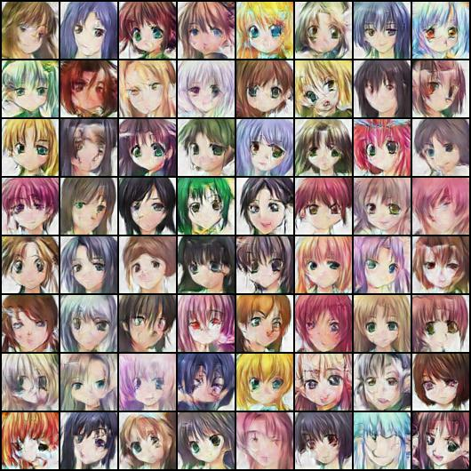
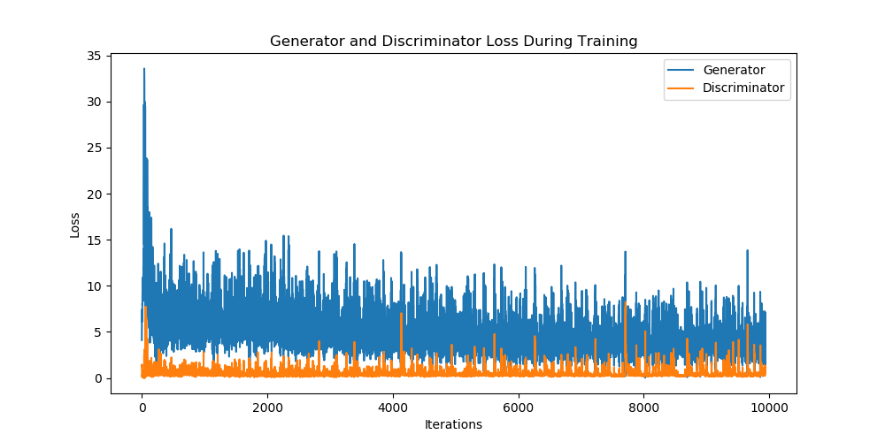

# Anime Faces DCGAN

DCGAN to generate images of anime faces.

## Prerequisites

Please install following packages for Python 3:
- matplotlib
- torch>=1.0.0
- torchvision>=0.2.1
- [kaggle](https://github.com/Kaggle/kaggle-api)

Please also make sure your Kaggle API key is installed on your system.

## Steps for Training

* Clone the project.
```bash
git clone https://github.com/SuJiaKuan/anime_faces_dcgan
```

* Go into the proejct root directory.
```bash
cd anime_faces_dcgan
```

* Create a folder for anime faces dataset.
```bash
mkdir anime_faces
```

* Go into the dataset directory
```bash
cd anime_faces
```

* Download the zip file from [Anime Face Dataset](https://www.kaggle.com/splcher/animefacedataset), the file name is `animefacedataset.zip`.
```bash
kaggle datasets download -d splcher/animefacedataset
```

* Unzip the file.
```bash
unzip animefacedataset.zip
```

* Go back to the project root directory.
```bash
cd ..
```

* Run the training script.
```bash
python3 train.py
```

* After training completed, the training results will be saved in `output` folder.

## Results

Generated images sample:



Loss for during training:


